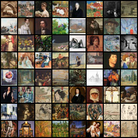
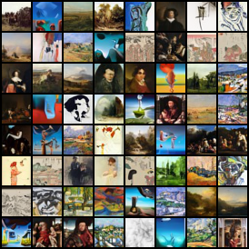

# Benchmarking Generative Models on ArtBench-10
### A Comparative Study of VAEs, GANs, and DDPMs

> João Vaz and Leonardo Silva — Department of Informatics Engineering, University of Coimbra

| Real Samples | DDPM (best, full dataset) |
|---|---|
|  |  |

---

## Overview

This project implements and evaluates three families of generative models on the [ArtBench-10](https://www.kaggle.com/datasets/alexanderliao/artbench10) dataset, a benchmark of 32×32 paintings spanning ten distinct artistic styles:

**Art Nouveau · Baroque · Expressionism · Impressionism · Post-Impressionism · Realism · Renaissance · Romanticism · Surrealism · Ukiyo-e**

Models compared:
- **β-VAE** — Variational Autoencoder with KL annealing
- **DCGAN** — Deep Convolutional GAN with label smoothing and asymmetric learning rates
- **DDPM** — Denoising Diffusion Probabilistic Model with Classifier-Free Guidance (CFG), EMA, and DDIM sampling

[Read the full report](docs/Report.pdf)

---

## Results

| Model | FID ↓ | KID ↓ | Inference (5k samples) |
|---|---|---|---|
| β-VAE (β=0.1, dz=64) | 97.39 ± 0.38 | 0.10608 ± 0.00123 | ~1.6s |
| DCGAN (ngf=256, LS, LR/2) | 18.79 ± 0.36 | 0.01201 ± 0.00053 | ~6.7s |
| DDPM (20% subset, w=5.0, 500ep) | 12.29 ± 0.31 | 0.00378 ± 0.00044 | ~17 min |
| **DDPM (full dataset, w=5.0, 50 steps)** | **9.28 ± 0.10** | **0.00264 ± 0.00031** | ~42 min |

The final DDPM surpasses all unconditional diffusion baselines reported in the original ArtBench paper, including DDIM (FID=17.56) and Improved DDPM (FID=15.31).

---

## Project Structure

```
artbench-generative-benchmark/
├── README.md
├── docs/
│   ├── Report.pdf                          # Final report
│   └── GENAI__TP1_Enunciado_2026_v2.pdf    # Project brief
├── DATA/
│   ├── ArtBench-10/                        # Dataset
│   ├── training_20_percent.csv             # 20% subset indices
│   └── scripts/
│       └── artbench_local_dataset.py       # Data loading utilities
└── src/
    ├── beta_VAE.py                         # β-VAE implementation
    ├── GAN.py                              # DCGAN implementation
    ├── diffusion.py                        # DDPM + CFG + DDIM
    ├── metrics.py                          # FID/KID evaluation
    ├── evaluate_all.py                     # Evaluate all models
    ├── style.py                            # Generate images per style
    ├── evaluation_results.json             # Evaluation results
    ├── models/                             # Checkpoints (.pt, via Git LFS)
    ├── DCGAN_losses/                       # Training loss plots
    ├── histories/                          # Beta-VAE training histories 
    ├── exported_data/
    │   └── train_subset/                   # Exported training subset images
    └── samples/                            # Generated image grids
```

___

## Installation

```bash
pip install torch torchvision numpy matplotlib scikit-learn tqdm datasets
```

---

## Training

### β-VAE
```bash
cd src
python3 beta_VAE.py --mode train --epochs 300 --beta 0.1 --latent_dim 64 --run_name vae_b01_z64
```

### DCGAN
```bash
cd src
python3 GAN.py --mode train
```

### DDPM
```bash
# 20% subset
cd src
python3 diffusion.py --mode train --config cfg_w3 --epochs 500

# Full dataset
python3 diffusion.py --mode train --config best --full_dataset

# Resume from checkpoint
python3 diffusion.py --mode train --config cfg_w3 --epochs 500 --resume models/cfg_w3_ep0300.pt
```

---

## Evaluation

```bash
cd src
python3 evaluate_all.py
```

Results are saved to `evaluation_results.json`.

Evaluation protocol:
- 5,000 generated samples vs 5,000 real images
- FID and KID computed across 10 random seeds
- KID reported as mean ± std over 50 subsets of size 100

---

## Sampling

```bash
# Generate samples from best DDPM
cd src
python3 diffusion.py --mode sample --config best --checkpoint models/best_full_final.pt
```

---

## Model Checkpoints

Checkpoints are stored with Git LFS. Run `git lfs pull` to download all `.pt` files.

| Checkpoint | Model | Description |
|---|---|---|
| `artbench_beta_vae_01_latent64.pt` | β-VAE | Best VAE (β=0.1, dz=64) |
| `artBenchDCGAN_LS_halfLR_ngf256.pt` | DCGAN | Best GAN (ngf=256, LS, LR/2) |
| `cfg_w3_final.pt` | DDPM | Best DDPM 20% subset |
| `best_full_final.pt` | DDPM | Best DDPM full dataset |

---

## Ablations

### β-VAE
| β | dz | FID |
|---|---|---|
| 0.1 | 64 | **97.39** |
| 0.1 | 128 | 98.29 |
| 0.1 | 256 | 102.76 |
| 0.5 | 128 | 112.17 |
| 1.0 | 128 | 136.65 |

### DCGAN
| Config | ngf | FID |
|---|---|---|
| Base | 64 | 22.42 |
| + Label Smoothing | 64 | 22.04 |
| + LS + LR/2 | 64 | 21.60 |
| + LS + LR/4 | 64 | 26.46 |
| + LS + LR/2 | 128 | 20.13 |
| **+ LS + LR/2** | **256** | **18.79** |

### DDPM
| Config | Epochs | FID |
|---|---|---|
| Baseline (no CFG) | 500 | 21.97 |
| cfg_w1 (w=1.5) | 300 | 33.36 |
| cfg_w2 (w=3.0) | 500 | 12.79 |
| **cfg_w3 (w=5.0)** | **500** | **12.29** |
| cap_64 (C=64) | 500 | 15.19 |
| no_ema | 500 | 12.22 |
| **best (full dataset, 50 steps)** | **500** | **9.28** |

---
